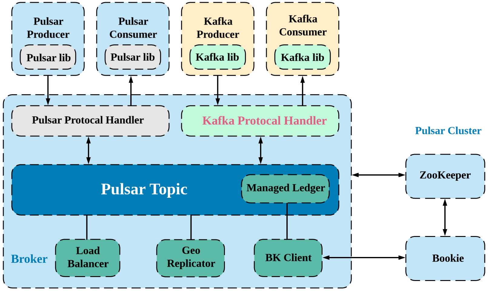

# Kafka-on-Pulsar (KoP)

KoP (Kafka on Pulsar) brings the native Apache Kafka protocol support to Apache Pulsar by introducing a Kafka protocol handler on Pulsar brokers. By adding the KoP protocol handler to your existing Pulsar cluster, you can migrate your existing Kafka applications and services to Pulsar without modifying the code. This enables Kafka applications to leverage Pulsar’s powerful features, such as:

- Streamlined operations with enterprise-grade multi-tenancy
- Simplified operations with a rebalance-free architecture
- Infinite event stream retention with Apache BookKeeper and tiered storage
- Serverless event processing with Pulsar Functions

KoP, implemented as a Pulsar [protocol handler](https://github.com/apache/pulsar/blob/master/pulsar-broker/src/main/java/org/apache/pulsar/broker/protocol/ProtocolHandler.java) plugin with the protocol name "kafka", is loaded when Pulsar broker starts. It helps reduce the barriers for people adopting Pulsar to achieve their business success by providing a native Kafka protocol support on Apache Pulsar. By integrating the two popular event streaming ecosystems, KoP unlocks new use cases. You can leverage advantages from each ecosystem and build a truly unified event streaming platform with Apache Pulsar to accelerate the development of real-time applications and services.

KoP implements the Kafka wire protocol on Pulsar by leveraging the existing components (such as topic discovery, the distributed log library - ManagedLedger, cursors and so on) that Pulsar already has.

The following figure illustrates how the Kafka-on-Pulsar protocol handler is implemented within Pulsar.

# What's New in KoP 2.8.0
The following new features are introduced in KoP 2.8.0.

- Offset management
- Message encoding and decoding
- OAuth 2.0 authentication
- Metrics related to produce, fetch and request

## Enhancement 
The following enhancement is added in KoP 2.8.0.
- Support more clients for Kafka admin
- Enable advertised listeners, so users can use Envoy Kafka filter directly

## Deprecated features
The property name of Kafka listener `listeners` is deprecated. Instead, you can use `kafkaListeners` since KoP 2.8.0.

# Version compatibility

Since Pulsar 2.6.2, KoP version changes with Pulsar version accordingly. The version of KoP `x.y.z.m` conforms to Pulsar `x.y.z`, while `m` is the patch version number. 

| KoP version | Pulsar version |
| :---------- | :------------- |
| [2.8.0](https://github.com/streamnative/kop/releases/tag/v2.8.0) |Pulsar 2.8.0|
| [2.7.0](https://github.com/streamnative/kop/releases/tag/v2.7.0) |Pulsar 2.7.0|
| [2.6.2](https://github.com/streamnative/kop/releases/tag/v2.6.2) |Pulsar 2.6.2|
| [0.3.0](https://github.com/streamnative/kop/releases/tag/v0.3.0) |Pulsar 2.6.1|
| [0.2.0](https://github.com/streamnative/kop/releases/tag/v0.2.0) |Pulsar 2.5.0|
| [0.1.0](https://github.com/streamnative/kop/releases/tag/v0.1.0) |Pulsar 2.5.0|

## Known Compatibility Issues
KoP-2.8.0.13, 2.8.0.14, 2.8.0.15 and 2.8.0.16 minor versions with Pulsar-2.8.0 have a known compatibility issue [KoP-768](https://github.com/streamnative/kop/issues/768).

# How to use KoP
You can configure and manage KoP based on your requirements. Check the following guides for more details.
- [Quick Start](docs/kop.md)
- [Configure KoP](docs/configuration.md)
- [Secure KoP](docs/security.md)
- [Manage KoP with the Envoy proxy](docs/envoy-proxy.md)
- [Implementation: How to converse Pulsar and Kafka](docs/implementation.md)

# Project Maintainers

-   [@aloyszhang](https://github.com/aloyszhang)
-   [@BewareMyPower](https://github.com/BewareMyPower)
-   [@Demogorgon314](https://github.com/Demogorgon314)
-   [@dockerzhang](https://github.com/dockerzhang)
-   [@hangc0276](https://github.com/hangc0276)
-   [@jiazhai](https://github.com/jiazhai)
-   [@PierreZ](https://github.com/PierreZ)
-   [@wuzhanpeng](https://github.com/wuzhanpeng)
