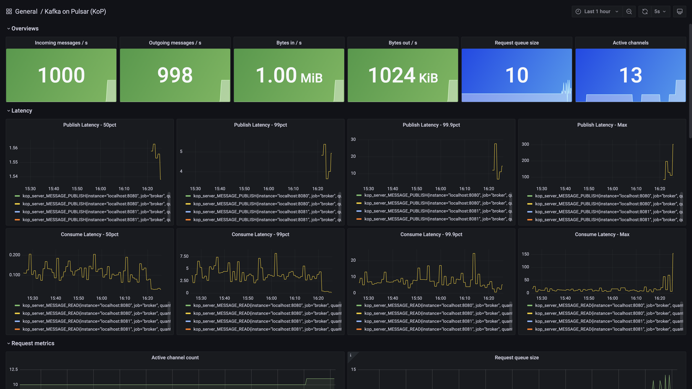

# Grafana Dashboard

You can find the Grafana dashboard in this directory that visualizes the KoP metrics.

## Prerequisites

The dashboard has been tested with the following software versions:

*  KoP >= 2.9.0
*  Grafana >= v8.4.3
*  Prometheus >= v2.0.0

A Prometheus data source needs to be [added](https://prometheus.io/docs/visualization/grafana/#using) before installing the dashboard.

## Installing the Dashboard

To install the Grafana Dashboard, follow these steps in the Grafana UI:

1.  Click **New Dashboard** and then click **Import**.
2.  Upload the `dashboard.json` JSON file or copy and paste the contents of the file in the textbox and then click **Load**.
3.  Set the Prometheus data source and click **Import**.
4.  The dashboard will appear. 

